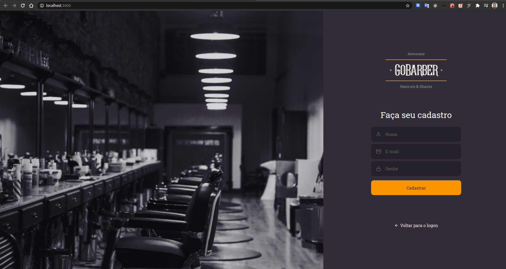

# Go Barber WEB

> ⚒👷 __UNDER CONSTRUCTION__ 👷⚒

## Description

In the world there are a bunch of barbers that is concerned about do their jobs as the best they can.

Create an easy way to the client book an appointment with his preferred barber or any other barber, is also a way to offer more comfort to the client when cutting his hair because a happy client is the certain that the job is being do the right way and business will be prosper.

This project is concerned about that. To provide a solution that facilitate the work of maintain the relation between clients and professionals in order to help clients when they needs a cut hair and professionals when they need to organize the clients and provide the service.

## App

## Why

That is the final project from the course Go Stack from [Rocket Seat](https://github.com/Rocketseat). And I'm adding this project for my personal portifolio, so if you could let me any feedback I'd appreciate so much. Any comment that can make me a better programmer will be help a lot!

And for sure, you can use this Project as you wish!

It's free!

## Contact info

My [LinkedIn](https://www.linkedin.com/in/bruno8moura/)

My email bruno8moura@gmail.com

## Getting started

### Prerequisites

NodeJS version: ^12

## Running application

yarn start

## Build with

- [axios](https://www.npmjs.com/package/axios) - A lib ot make http requests. It is a good choice because we can patterned the url base for a especifi domain.
- [polished](https://www.npmjs.com/package/polished) - Tool for creating styles for your html.
- [react](https://www.npmjs.com/package/react) - The core library for React.
- [react-dom](https://www.npmjs.com/package/react-dom) - Enable React to communicate with HTML throught the DOM API.
- [react-router-dom](https://www.npmjs.com/package/react-router-dom) - DOM bindings for React Router.
- [react-scripts](https://www.npmjs.com/package/react-scripts) - Scripts and configurations used by 'create-react-app' app.
- [styled-components](https://www.npmjs.com/package/styled-components) - A powerful tool that helps in css organization, isolating the css by components.
- [typescript](https://www.npmjs.com/package/typescript) - Superset of features for javascript language.
